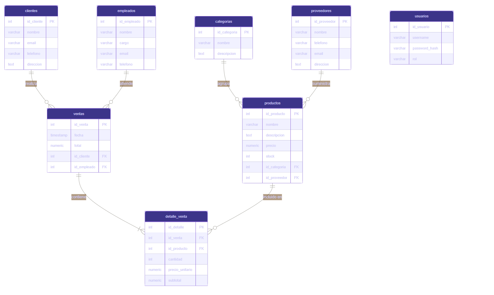

# TiendaDB — Proyecto 2
**Bases de Datos 1 | Wilson Peña - 24760**

Sistema web para gestión de inventario y ventas. Stack: **Python/Flask · PostgreSQL · HTML/CSS/JS · Docker**.

---

## Levantar el proyecto

```bash
# 1. Clonar el repositorio
git clone <URL_DEL_REPO>
cd tienda

# 2. Copiar variables de entorno (ya vienen configuradas)
cp .env.example .env

# 3. Levantar con Docker
docker compose up --build
```

Abrir en el navegador: **http://localhost:5000**

| Usuario | Contraseña | Rol |
|---------|-----------|-----|
| admin   | admin123  | admin |

> El usuario `admin` se crea automáticamente al primer arranque.

---

## Estructura del proyecto

```
tienda/
├── docker-compose.yml
├── Dockerfile
├── .env
├── .env.example
├── db/
│   ├── 01_schema.sql      ← DDL: tablas, índices, VIEW
│   └── 02_seed.sql        ← Datos de prueba 
├── backend/
│   ├── app.py             ← rutas, lógica, SQL explícito
│   └── requirements.txt
└── frontend/
    ├── templates/         ← base, login, dashboard, etc.
    └── static/            ← CSS y JS
```

---

## I. Diseño de Base de Datos

### Diagrama ER 


### Diagrama DDL

#### Entidades y atributos principales

| Entidad | Atributos clave |
|---------|----------------|
| categorias | **id_categoria** (PK), nombre, descripcion |
| proveedores | **id_proveedor** (PK), nombre, telefono, email, direccion |
| productos | **id_producto** (PK), nombre, descripcion, precio, stock, id_categoria (FK), id_proveedor (FK) |
| empleados | **id_empleado** (PK), nombre, cargo, email, telefono |
| clientes | **id_cliente** (PK), nombre, email, telefono, direccion |
| ventas | **id_venta** (PK), fecha, total, id_cliente (FK), id_empleado (FK) |
| detalle_venta | **id_detalle** (PK), id_venta (FK), id_producto (FK), cantidad, precio_unitario, subtotal |
| usuarios | **id_usuario** (PK), username (UNIQUE), password_hash, rol |

#### Cardinalidades

- Una **categoría** tiene muchos **productos** (1:N)
- Un **proveedor** suministra muchos **productos** (1:N)
- Un **cliente** realiza muchas **ventas** (1:N)
- Un **empleado** atiende muchas **ventas** (1:N)
- Una **venta** contiene muchos **detalles** (1:N)
- Un **producto** aparece en muchos **detalles** (1:N)

---

### Modelo Relacional (notación relacional)

```
categorias   ( id_categoria, nombre, descripcion )
proveedores  ( id_proveedor, nombre, telefono, email, direccion )
productos    ( id_producto, nombre, descripcion, precio, stock,
               id_categoria → categorias, id_proveedor → proveedores )
empleados    ( id_empleado, nombre, cargo, email, telefono )
clientes     ( id_cliente, nombre, email, telefono, direccion )
ventas       ( id_venta, fecha, total,
               id_cliente → clientes, id_empleado → empleados )
detalle_venta( id_detalle, id_venta → ventas, id_producto → productos,
               cantidad, precio_unitario, subtotal )
usuarios     ( id_usuario, username, password_hash, rol )
```

---

### Normalización hasta 3FN

#### Tabla `productos`

**1FN:** Todos los atributos son atómicos, no hay grupos repetitivos.
`(id_producto, nombre, descripcion, precio, stock, id_categoria, id_proveedor)`

**2FN:** La PK es simple, por lo que toda dependencia parcial es imposible. Se cumple automáticamente.

**3FN:** Verificar que no existan dependencias transitivas:
- `nombre, precio, stock` dependen solo de `id_producto` ✓
- `id_categoria` es FK, no guarda el nombre de la categoría en esta tabla ✓
- `id_proveedor` es FK, no guarda datos del proveedor aquí ✓

**→ La tabla está en 3FN.**

---

#### Tabla `detalle_venta`

**1FN:** Atributos atómicos, sin multivaluados ✓

**2FN:** PK es `id_detalle`. Sin dependencias parciales ✓

**3FN:** `precio_unitario` se copia al momento de la venta. No depende de `id_producto` directamente en esta tabla, es un dato capturado en el momento de la transacción, no derivado. `subtotal = cantidad × precio_unitario` es un atributo calculado que se almacena por eficiencia en reportes.

**→ La tabla está en 3FN.**

---

#### Tabla `ventas`

**Atributos:** (id_venta, fecha, total, id_cliente, id_empleado)

**1FN:** Todos los atributos son atómicos. No hay grupos repetitivos. ✓

**2FN:** PK simple (`id_venta`), por lo que no existen dependencias parciales posibles. ✓

**3FN:** `fecha` y `total` dependen únicamente de `id_venta`. `id_cliente` e `id_empleado` son FK — no almacenan datos del cliente ni del empleado en esta tabla. Sin dependencias transitivas.

**→ `ventas` está en 3FN.** ✓

---

#### Tabla `clientes`

**Atributos:** (id_cliente, nombre, email, telefono, direccion)

**1FN:** Atributos atómicos. `direccion` es texto libre — no se descompone porque el negocio no requiere consultas por componente. ✓

**2FN:** PK simple → no hay dependencias parciales. ✓

**3FN:** `nombre`, `email`, `telefono`, `direccion` dependen directamente de `id_cliente`. Ningún atributo depende de otro atributo no clave.

**→ `clientes` está en 3FN.** ✓

---

#### Tabla `proveedores`

**Atributos:** (id_proveedor, nombre, telefono, email, direccion)

**1FN:** Atributos atómicos, sin multivaluados. ✓

**2FN:** PK simple → no hay dependencias parciales. ✓

**3FN:** `nombre`, `telefono`, `email`, `direccion` dependen únicamente de `id_proveedor`. Sin dependencias transitivas.

**→ `proveedores` está en 3FN.** ✓

---

#### Tabla `empleados`

**Atributos:** (id_empleado, nombre, cargo, email, telefono)

**1FN:** Atributos atómicos. ✓

**2FN:** PK simple → sin dependencias parciales. ✓

**3FN:** `cargo` depende de `id_empleado`, no de ningún otro atributo no clave. No existe tabla separada de cargos porque el dominio no requiere gestionar cargos como entidad independiente.

**→ `empleados` está en 3FN.** ✓

---

#### Tabla `categorias`

**Atributos:** (id_categoria, nombre, descripcion)

**1FN → 3FN:** PK simple, atributos atómicos, `nombre` y `descripcion` dependen únicamente de `id_categoria`. Sin dependencias transitivas.

**→ `categorias` está en 3FN.** ✓

---

#### Tabla `usuarios`

**Atributos:** (id_usuario, username, password_hash, rol)

**1FN → 3FN:** `username` es UNIQUE (clave candidata alternativa). `password_hash` y `rol` dependen de `id_usuario`. Sin dependencias transitivas.

**→ `usuarios` está en 3FN.** ✓

---

### Resumen de dependencias funcionales

| Tabla | Dependencias funcionales |
|-------|--------------------------|
| categorias | id_categoria → nombre, descripcion |
| proveedores | id_proveedor → nombre, telefono, email, direccion |
| productos | id_producto → nombre, descripcion, precio, stock, id_categoria, id_proveedor |
| empleados | id_empleado → nombre, cargo, email, telefono |
| clientes | id_cliente → nombre, email, telefono, direccion |
| ventas | id_venta → fecha, total, id_cliente, id_empleado |
| detalle_venta | id_detalle → id_venta, id_producto, cantidad, precio_unitario, subtotal |
| usuarios | id_usuario → username, password_hash, rol |

---

## II. SQL — Consultas implementadas en la UI

Todas las consultas se ejecutan desde la aplicación web.

### JOINs (3 consultas)

**JOIN 1: Dashboard:** Últimas ventas con nombre de cliente y empleado
```sql
SELECT v.id_venta, v.fecha, v.total,
       c.nombre AS cliente, e.nombre AS empleado
FROM ventas v
JOIN clientes  c ON c.id_cliente  = v.id_cliente
JOIN empleados e ON e.id_empleado = v.id_empleado
ORDER BY v.fecha DESC LIMIT 5
```

**JOIN 2: Productos:** Productos con categoría y proveedor
```sql
SELECT p.*, c.nombre AS categoria, pr.nombre AS proveedor
FROM productos p
JOIN categorias  c  ON c.id_categoria = p.id_categoria
JOIN proveedores pr ON pr.id_proveedor = p.id_proveedor
```

**JOIN 3: Ventas:** Ventas con cliente, empleado y cantidad de ítems
```sql
SELECT v.id_venta, v.fecha, v.total,
       c.nombre AS cliente, e.nombre AS empleado,
       COUNT(dv.id_detalle) AS items
FROM ventas v
JOIN clientes  c  ON c.id_cliente  = v.id_cliente
JOIN empleados e  ON e.id_empleado = v.id_empleado
LEFT JOIN detalle_venta dv ON dv.id_venta = v.id_venta
GROUP BY v.id_venta, v.fecha, v.total, c.nombre, e.nombre
```

### Subqueries (2 consultas)

**Subquery correlacionado: Clientes:** Número de compras y total gastado por cliente
```sql
SELECT c.*,
  (SELECT COUNT(*) FROM ventas v WHERE v.id_cliente = c.id_cliente) AS num_compras,
  (SELECT COALESCE(SUM(v.total),0) FROM ventas v WHERE v.id_cliente = c.id_cliente) AS total_gastado
FROM clientes c
```

**Subquery IN: Ventas:** Productos con stock disponible vendidos en los últimos 6 meses
```sql
SELECT p.*, c.nombre AS categoria
FROM productos p
JOIN categorias c ON c.id_categoria = p.id_categoria
WHERE p.stock > 0
  AND p.id_producto IN (
      SELECT DISTINCT dv.id_producto
      FROM detalle_venta dv
      JOIN ventas v ON v.id_venta = dv.id_venta
      WHERE v.fecha >= NOW() - INTERVAL '6 months'
  )
ORDER BY p.nombre
```

### GROUP BY + HAVING + Agregación: Reportes

```sql
SELECT c.nombre AS categoria,
       COUNT(DISTINCT v.id_venta) AS num_ventas,
       SUM(dv.subtotal)           AS total_ingresos,
       AVG(dv.subtotal)           AS promedio_por_item
FROM detalle_venta dv
JOIN productos  p ON p.id_producto  = dv.id_producto
JOIN categorias c ON c.id_categoria = p.id_categoria
JOIN ventas     v ON v.id_venta     = dv.id_venta
GROUP BY c.nombre
HAVING COUNT(DISTINCT v.id_venta) > 1
ORDER BY total_ingresos DESC
```

### CTE (WITH): Reportes

```sql
WITH gasto_clientes AS (
    SELECT c.id_cliente, c.nombre,
           COUNT(v.id_venta) AS num_compras,
           SUM(v.total)      AS total_gastado
    FROM clientes c
    JOIN ventas v ON v.id_cliente = c.id_cliente
    GROUP BY c.id_cliente, c.nombre
)
SELECT * FROM gasto_clientes
ORDER BY total_gastado DESC LIMIT 5
```

### VIEW

```sql
CREATE VIEW vista_reporte_ventas AS
SELECT p.nombre AS producto, c.nombre AS categoria,
       SUM(dv.cantidad)            AS unidades_vendidas,
       SUM(dv.subtotal)            AS ingresos_totales,
       COUNT(DISTINCT dv.id_venta) AS num_ventas
FROM detalle_venta dv
JOIN productos  p ON p.id_producto  = dv.id_producto
JOIN categorias c ON c.id_categoria = p.id_categoria
GROUP BY p.id_producto, p.nombre, c.nombre
```

### Transacción explícita con ROLLBACK

En `POST /ventas/nueva` (archivo `backend/app.py`):

```python
conn.autocommit = False
cur.execute("BEGIN")             # BEGIN explícito
try:
    # Verificar stock con FOR UPDATE (bloqueo)
    # INSERT ventas
    # INSERT detalle_venta (por cada ítem)
    # UPDATE productos SET stock = stock - cantidad
    conn.commit()                # COMMIT
except Exception as e:
    conn.rollback()              # ROLLBACK si falla cualquier paso
```

---

## III. Aplicación web

### CRUD implementado

| Entidad | Crear | Leer | Actualizar | Eliminar |
|---------|-------|------|-----------|---------|
| Productos | ✓ | ✓ | ✓ | ✓ |
| Clientes  | ✓ | ✓ | ✓ | ✓ |
| Empleados | ✓ | ✓ | ✓ | ✓ |
| Ventas    | ✓ | ✓ | — | — |

### Reportes visibles en UI

- `/reportes`: Ventas por producto (VIEW), ingresos por categoría (GROUP BY/HAVING), top 5 clientes (CTE)
- `/reportes/exportar-csv`: Descarga el reporte de ventas como CSV

### Manejo de errores

- Validación de campos obligatorios antes de ejecutar SQL
- Mensajes flash de éxito/error visibles en la interfaz
- ROLLBACK automático con mensaje descriptivo al usuario si falla una transacción

---

## IV. Avanzado

- **Autenticación:** Login/logout con `flask.session` y contraseñas hasheadas con `werkzeug`
- **Exportar CSV:** Botón en `/reportes` descarga `reporte_ventas.csv`

---

## Índices justificados

```sql
-- Búsquedas por nombre de producto (filtros en UI)
CREATE INDEX idx_productos_nombre    ON productos(nombre);

-- Reportes de ventas por rango de fecha
CREATE INDEX idx_ventas_fecha        ON ventas(fecha);

-- Filtros de productos por categoría
CREATE INDEX idx_productos_categoria ON productos(id_categoria);
```

---

## Credenciales de base de datos

| Variable | Valor |
|----------|-------|
| DB_USER | `proy2` |
| DB_PASSWORD | `secret` |
| DB_NAME | `tiendadb` |
| DB_HOST | `db` (servicio Docker) |
